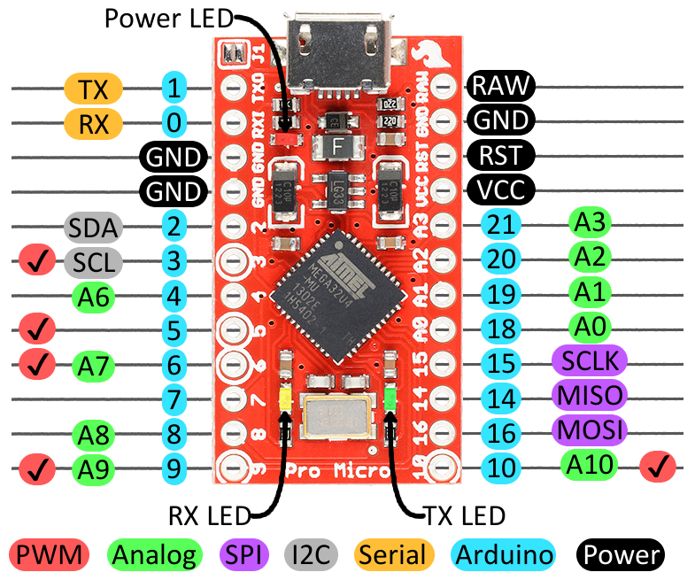

# tbkmini-col2row-zmk

### PCB:
- This Firmware assumes that you use this PCB https://github.com/Bastardkb/Dactyl-Manuform-PCB-Plate
- 
    (**NOT** this one: https://github.com/Bastardkb/Skeletyl-PCB-plate)

### Pins

- This firmware assumes that you wired your PCB to your nice!nano in the following way:

```
PCB Pin | MCU Pin
R2      | 4
R3      | 5
R4      | 6
R6      | 7
```

```
PCB Pin | MCU Pin
C1      | 19 (only used for TBKmini, not for Skeltyl)
C2      | 18
C3      | 15
C4      | 14
C5      | 16
C6      | 10
```

```
Thumb PCB Pins
C2, C4, C5, R6
```



image from https://zmk.dev/docs/development/boards-shields-keymaps